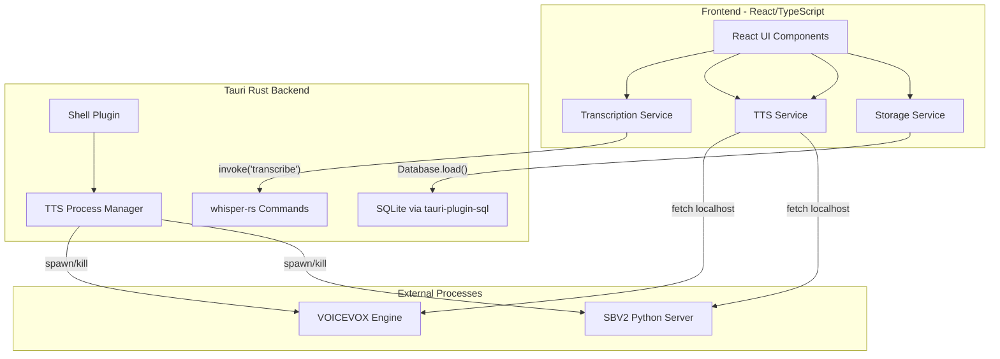

# Tama Desktop: Tauri v2 Conversion Plan

## Architecture Overview




The existing React frontend stays largely intact. The main changes are:

- **Whisper**: `fetch()` to OpenAI API --> `invoke()` to Rust whisper-rs
- **TTS management**: Vite server plugins --> Tauri Rust commands via Shell plugin
- **Storage**: `localStorage` --> SQLite via `tauri-plugin-sql`
- **TTS audio synthesis**: `fetch()` to localhost servers stays the same (works in Tauri's webview)

---

## Phase 1: Tauri Scaffolding

### 1a. Initialize Tauri in the existing project

After forking, add Tauri v2 to the project:

```bash
npm install --save-dev @tauri-apps/cli@latest
npm run tauri init
```

This creates `src-tauri/` with `Cargo.toml`, `tauri.conf.json`, `src/lib.rs`, etc.

### 1b. Configure `tauri.conf.json`

```json
{
  "build": {
    "beforeDevCommand": "npm run dev",
    "beforeBuildCommand": "npm run build",
    "devUrl": "http://localhost:5173",
    "frontendDist": "../dist"
  },
  "app": {
    "productName": "Tama",
    "identifier": "com.tama.desktop"
  }
}
```

### 1c. Update `vite.config.ts`

Remove the VOICEVOX/SBV2 Vite plugins and the OpenAI proxy (all moving to Rust). Add Tauri-specific dev server settings:

```typescript
export default defineConfig({
  plugins: [react(), tailwindcss()],
  clearScreen: false,
  server: {
    port: 5173,
    strictPort: true,
    host: process.env.TAURI_DEV_HOST || false,
    hmr: process.env.TAURI_DEV_HOST
      ? { protocol: 'ws', host: process.env.TAURI_DEV_HOST, port: 1421 }
      : undefined,
    watch: { ignored: ['**/src-tauri/**'] },
  },
  envPrefix: ['VITE_', 'TAURI_ENV_*'],
  // ... keep alias config
});
```

### 1d. Verify the app runs

```bash
npm run tauri dev
```

At this point the existing web app should render inside the Tauri window with no functional changes yet.

---

## Phase 2: Local Whisper Transcription (whisper-rs)

This is the core feature -- replacing the OpenAI Whisper API with local inference.

### 2a. Rust dependencies (`src-tauri/Cargo.toml`)

```toml
[dependencies]
whisper-rs = { version = "0.15", features = ["metal"] }  # metal for macOS GPU
hound = "3.5"          # WAV decoding
serde = { features = ["derive"] }
serde_json = "1"
tokio = { version = "1", features = ["full"] }
reqwest = { version = "0.12", features = ["blocking"] }  # model download
```

Use feature flags for platform-specific acceleration:

- macOS: `metal`
- Windows/Linux with NVIDIA: `cuda`
- Fallback: CPU (no feature)

### 2b. Rust module: `src-tauri/src/whisper.rs`

Key design decisions:

- **Model management**: Download `ggml-small.bin` (~487MB) to the app data directory on first use. Show download progress via Tauri events.
- **Audio format**: The frontend records WebM/Opus. Rust decodes this to 16kHz mono f32 PCM using `symphonia` or `ffmpeg` bindings. Alternatively, have the frontend send raw PCM using the Web Audio API's `AudioContext` to decode before sending.
- **Thread safety**: Load the `WhisperContext` once at startup (wrapped in `Arc<Mutex<>>` or similar), reuse across transcription requests.
- **Language**: Default to Japanese (`"ja"`) matching the app's purpose.

```rust
use whisper_rs::{WhisperContext, WhisperContextParameters, FullParams, SamplingStrategy};
use std::sync::Arc;
use tokio::sync::Mutex;
use tauri::State;

pub struct WhisperState {
    pub context: Arc<Mutex<Option<WhisperContext>>>,
}

#[tauri::command]
pub async fn load_whisper_model(
    app: tauri::AppHandle,
    state: State<'_, WhisperState>,
) -> Result<(), String> {
    // 1. Resolve model path in app data dir
    // 2. Download ggml-small.bin if not present (emit progress events)
    // 3. Load WhisperContext and store in state
}

#[tauri::command]
pub async fn transcribe_audio(
    audio_data: Vec<u8>,    // raw 16kHz mono f32 PCM bytes from frontend
    language: Option<String>,
    state: State<'_, WhisperState>,
) -> Result<String, String> {
    // 1. Convert bytes to &[f32]
    // 2. Configure FullParams (Greedy, language="ja", threads=4)
    // 3. Run state.full(params, &audio) on a blocking thread
    // 4. Collect segments and return text
}

#[tauri::command]
pub async fn get_model_status(
    app: tauri::AppHandle,
) -> Result<ModelStatus, String> {
    // Check if model file exists, return size/status
}
```

### 2c. Audio format bridge (frontend side)

The cleanest approach: use the Web Audio API in the frontend to convert the recorded WebM blob to raw PCM before sending to Rust.

Create `src/services/audio-utils.ts`:

```typescript
export async function blobToFloat32PCM(blob: Blob, targetSampleRate = 16000): Promise<Float32Array> {
  const arrayBuffer = await blob.arrayBuffer();
  const audioContext = new OfflineAudioContext(1, 1, targetSampleRate);
  const audioBuffer = await audioContext.decodeAudioData(arrayBuffer);

  // Resample to target rate
  const offlineCtx = new OfflineAudioContext(1, 
    Math.ceil(audioBuffer.duration * targetSampleRate), targetSampleRate);
  const source = offlineCtx.createBufferSource();
  source.buffer = audioBuffer;
  source.connect(offlineCtx.destination);
  source.start();
  const rendered = await offlineCtx.startRendering();
  return rendered.getChannelData(0);
}
```

### 2d. Frontend transcription service: `src/services/whisper-local.ts`

```typescript
import { invoke } from '@tauri-apps/api/core';
import { blobToFloat32PCM } from './audio-utils';

export async function transcribeAudioLocal(
  audioBlob: Blob,
  options: { language?: string } = {}
): Promise<string> {
  const pcm = await blobToFloat32PCM(audioBlob);
  const bytes = new Uint8Array(pcm.buffer);
  return invoke<string>('transcribe_audio', {
    audioData: Array.from(bytes),
    language: options.language ?? 'ja',
  });
}
```

### 2e. Update `VoiceModeScreen.tsx`

Replace the `transcribeAudio` import to use the local version. Add a provider pattern so both local and API-based transcription are available (user can choose in settings):

In [src/components/conversation/VoiceModeScreen.tsx](src/components/conversation/VoiceModeScreen.tsx), change:

```typescript
// Before
import { transcribeAudio } from "@/services/openai";
// After
import { transcribeAudio } from "@/services/transcription";
```

Create `src/services/transcription.ts` as the unified entry point that delegates to either `whisper-local.ts` or `openai.ts` based on user settings.

---

## Phase 3: Native TTS Process Management

Replace the Vite server plugins ([server/voicevox-control.ts](server/voicevox-control.ts) and [server/sbv2-control.ts](server/sbv2-control.ts)) with Tauri Rust commands.

### 3a. Install Tauri Shell plugin

```bash
npm run tauri add shell
```

### 3b. Rust module: `src-tauri/src/tts_manager.rs`

Port the logic from the Vite plugins to Rust:

```rust
use tauri_plugin_shell::ShellExt;
use std::sync::atomic::{AtomicU32, Ordering};

pub struct TTSProcessState {
    pub voicevox_pid: AtomicU32,
    pub sbv2_pid: AtomicU32,
}

#[tauri::command]
pub async fn voicevox_status(app: tauri::AppHandle) -> Result<VoicevoxStatus, String> {
    // Check if VOICEVOX is running (HTTP GET localhost:50021/version)
    // Check if engine binary exists in known paths
}

#[tauri::command]
pub async fn start_voicevox(app: tauri::AppHandle, state: State<'_, TTSProcessState>) -> Result<(), String> {
    // Find VOICEVOX binary (app data, system paths, bundled)
    // Spawn via shell plugin, store PID
}

#[tauri::command]
pub async fn stop_voicevox(state: State<'_, TTSProcessState>) -> Result<(), String> {
    // Kill process by stored PID
}

// Similar commands for SBV2: start_sbv2, stop_sbv2, sbv2_status
```

### 3c. VOICEVOX download

Port the download logic from the Vite plugin. Use `reqwest` to download from GitHub releases, extract with a Rust archive library. Emit progress events to the frontend.

### 3d. SBV2 proxy removal

Currently [src/services/tts-sbv2.ts](src/services/tts-sbv2.ts) uses `/api/sbv2-proxy` (Vite middleware). In Tauri, the webview can call `http://localhost:5001` directly since there are no CORS restrictions in a desktop app. Update `getSBV2BaseUrl()` to return `http://localhost:5001` (or the configured port).

### 3e. Frontend updates

Replace the current control components:

- [src/components/VoicevoxControl.tsx](src/components/VoicevoxControl.tsx): change `fetch('/api/voicevox-control/...')` to `invoke('voicevox_status')`, `invoke('start_voicevox')`, etc.
- [src/components/SBV2Control.tsx](src/components/SBV2Control.tsx): same pattern.

---

## Phase 4: SQLite Storage

Replace `localStorage` ([src/services/storage.ts](src/services/storage.ts)) with SQLite.

### 4a. Install tauri-plugin-sql

```bash
npm run tauri add sql
cargo add tauri-plugin-sql --features sqlite
```

### 4b. Define schema migrations

```sql
-- Migration 1: Initial tables
CREATE TABLE user_profile (
  id INTEGER PRIMARY KEY DEFAULT 1,
  jlpt_level TEXT NOT NULL DEFAULT 'N5',
  interests TEXT DEFAULT '[]',
  auto_adjust_level INTEGER DEFAULT 0,
  response_length TEXT DEFAULT 'natural'
);

CREATE TABLE vocab_items (
  id TEXT PRIMARY KEY,
  word TEXT NOT NULL,
  reading TEXT NOT NULL,
  meaning TEXT NOT NULL,
  jlpt_level TEXT,
  context_sentence TEXT,
  first_seen TEXT NOT NULL,
  last_reviewed TEXT,
  next_review TEXT NOT NULL,
  interval_days REAL NOT NULL DEFAULT 0,
  ease_factor REAL NOT NULL DEFAULT 2.5,
  repetitions INTEGER NOT NULL DEFAULT 0,
  source_session_id TEXT
);

CREATE TABLE sessions (
  id TEXT PRIMARY KEY,
  scenario_id TEXT NOT NULL,
  messages TEXT NOT NULL,  -- JSON array
  feedback TEXT,           -- JSON object
  started_at TEXT NOT NULL,
  ended_at TEXT
);

CREATE TABLE custom_scenarios (
  id TEXT PRIMARY KEY,
  data TEXT NOT NULL  -- JSON
);

CREATE TABLE ongoing_chats (
  id TEXT PRIMARY KEY,
  data TEXT NOT NULL  -- JSON
);
```

### 4c. Rewrite `src/services/storage.ts`

Replace every `localStorage.getItem`/`setItem` call with SQLite queries via `@tauri-apps/plugin-sql`:

```typescript
import Database from '@tauri-apps/plugin-sql';

let db: Database | null = null;

async function getDb(): Promise<Database> {
  if (!db) {
    db = await Database.load('sqlite:tama.db');
  }
  return db;
}

export async function getUserProfile(): Promise<UserProfile> {
  const d = await getDb();
  const rows = await d.select<UserProfile[]>('SELECT * FROM user_profile WHERE id = 1');
  // ... return profile or default
}
```

Note: This makes all storage operations **async**. All callers (components, hooks) will need minor updates to handle promises.

### 4d. Data migration

On first launch, check if `localStorage` has existing data and migrate it to SQLite, then clear localStorage. This ensures a smooth upgrade for users who switch from the web version.

---

## Phase 5: Settings UI Updates

### 5a. Transcription engine selector

Add a new section in [src/components/Settings.tsx](src/components/Settings.tsx) to choose between:

- **Local Whisper** (free, fast, offline) -- with model download status/progress
- **OpenAI API** (existing, requires API key)

When "Local Whisper" is selected, the OpenAI API key section can be hidden/collapsed.

### 5b. Model management UI

Show model download progress, current model size, and a button to download/remove models. This calls `invoke('load_whisper_model')` and `invoke('get_model_status')`.

---

## Phase 6: Cleanup and Polish

### 6a. Remove web-only infrastructure

- Delete [server/voicevox-control.ts](server/voicevox-control.ts), [server/sbv2-control.ts](server/sbv2-control.ts) (logic moved to Rust)
- Keep [server/sbv2_api.py](server/sbv2_api.py) (still needed, spawned by Tauri)
- Remove the OpenAI proxy from `vite.config.ts`
- Remove `@tauri-apps/cli` dev dependency is kept; `vite` stays for frontend dev

### 6b. App permissions

Configure `src-tauri/capabilities/default.json` with required permissions:

- `sql:default`, `sql:allow-execute`, `sql:allow-select`, `sql:allow-load`
- `shell:allow-execute`, `shell:allow-spawn`, `shell:allow-kill`
- Audio/microphone access (handled by OS permissions)

### 6c. Build and bundle

- Configure Tauri bundling for macOS (.dmg), Windows (.msi), Linux (.deb/.AppImage)
- Bundle VOICEVOX engine as a sidecar (optional, or download on first use)
- Ensure whisper model download works in production builds

---

## File Impact Summary


| Current File                                      | Change                                              |
| ------------------------------------------------- | --------------------------------------------------- |
| `vite.config.ts`                                  | Remove Vite plugins and proxy; add Tauri dev config |
| `server/voicevox-control.ts`                      | Delete (replaced by Rust)                           |
| `server/sbv2-control.ts`                          | Delete (replaced by Rust)                           |
| `server/sbv2_api.py`                              | Keep (spawned by Tauri instead of Vite)             |
| `src/services/openai.ts`                          | Keep but make optional (fallback engine)            |
| `src/services/storage.ts`                         | Rewrite to use SQLite (async)                       |
| `src/services/tts-sbv2.ts`                        | Update base URL (remove Vite proxy dependency)      |
| `src/components/Settings.tsx`                     | Add transcription engine selector, model management |
| `src/components/VoicevoxControl.tsx`              | Replace fetch with Tauri invoke                     |
| `src/components/SBV2Control.tsx`                  | Replace fetch with Tauri invoke                     |
| `src/components/conversation/VoiceModeScreen.tsx` | Use unified transcription service                   |
| **New: `src-tauri/`**                             | Entire Tauri Rust backend                           |
| **New: `src/services/whisper-local.ts`**          | Local Whisper frontend service                      |
| **New: `src/services/transcription.ts`**          | Unified transcription provider                      |
| **New: `src/services/audio-utils.ts`**            | WebM-to-PCM conversion utility                      |


