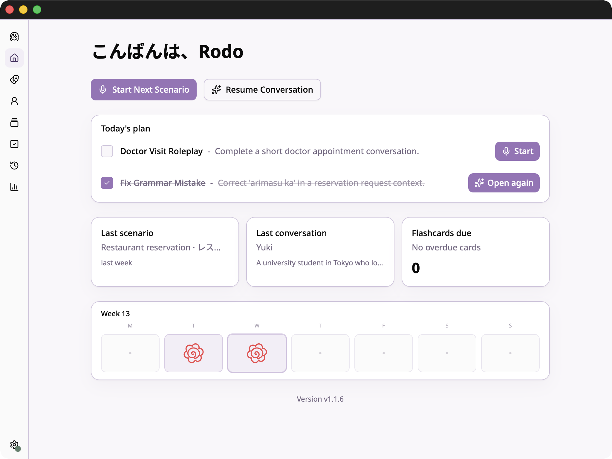

# Tama Desktop



Japanese conversation practice app built with Tauri + React.  
Current app includes scenario chat, shadow speaking practice, persistent persona chats, Sensei-guided study tools, quizzes, SRS flashcards, and study activity tracking.

## For Users (Start Here)

If you only want to use the app, this section is all you need. The rest of this README is for development/building from source.

### What It Is

Tama Desktop is a Japanese conversation practice app with speaking + listening practice, AI chat scenarios, and study tools like daily plans, quizzes, feedback, and flashcards.

### Main Features

- Scenario chat practice (text or voice)
- Shadow speaking practice with fixed AI-generated scripts and hiragana readings
- Persistent persona chats
- Sensei assistant for follow-up help, quiz generation, and study support
- Daily study plan on the home screen with quick actions
- Saved quizzes with review mode and hiragana readings for Japanese text
- Session feedback (grammar, vocabulary, fluency, rating)
- SRS flashcards and Anki export
- Session history plus weekly/monthly study activity tracking
- Account backup and restore
- Voice input with local Whisper or OpenAI Whisper API
- Japanese TTS with VOICEVOX or Style-Bert-VITS2

### How To Run It

1. Download the latest build from [Releases](https://github.com/rodolfo-terriquez/tama-desktop/releases).
2. Choose the file for your OS:
   - macOS (Apple Silicon): `*_aarch64.dmg`
   - Windows (x64): `*_x64-setup.exe` or `*_x64_en-US.msi`
   - Linux (x64): `*_amd64.AppImage`, `*_amd64.deb`, or `*.x86_64.rpm`

#### macOS

1. Move `Tama Desktop.app` to `Applications`.
2. If macOS says the app cannot be opened because it is from an unidentified developer, run:

```bash
xattr -dr com.apple.quarantine "/Applications/Tama Desktop.app"
```

3. Start the app from Terminal once:

```bash
"/Applications/Tama Desktop.app/Contents/MacOS/tama-desktop"
```

4. If prompted, open `System Settings -> Privacy & Security` and click `Open Anyway`.
5. Launch again (Finder or Terminal). After this one-time approval, it should open normally.

#### Windows

1. Run the `.exe` installer (or `.msi` package).
2. If SmartScreen appears, click `More info` -> `Run anyway`.
3. Open Tama Desktop from Start Menu.

#### Linux

Use the package format that matches your distro:

- AppImage:

```bash
chmod +x Tama_*_amd64.AppImage
./Tama_*_amd64.AppImage
```

- Debian/Ubuntu (`.deb`):

```bash
sudo apt install ./Tama_*_amd64.deb
```

- Fedora/RHEL (`.rpm`):

```bash
sudo dnf install ./Tama-*.x86_64.rpm
```

## Current State (March 2026)

Implemented:

- Scenario-based conversations (voice or text input)
- Shadow mode for fixed speaking drills with line-by-line practice
- Persistent persona chats with conversation summarization
- Sensei assistant with contextual help from the current screen
- Home dashboard with a daily study plan, quick resume actions, and study activity calendar
- Saved quizzes generated from Sensei requests, with score review and hiragana readings for Japanese text
- Session feedback (grammar, vocabulary, fluency, rating)
- SRS flashcards with SM-2 scheduling and Anki export
- Session history, weekly activity tracking, and monthly activity stats
- Account backup/restore for local progress and non-secret settings
- Two TTS engines:
  - VOICEVOX (managed from app; supports in-app download on supported platforms)
  - Style-Bert-VITS2 (optional local Python server)
- Two transcription engines:
  - Local Whisper (`ggml-small.bin`, downloaded in app)
  - OpenAI Whisper API
- Auto-update checks on app launch (production builds)

## Tech Stack

| Layer | Choice |
| --- | --- |
| Desktop shell | Tauri v2 (Rust) |
| Frontend | React 19 + TypeScript + Vite 7 |
| UI | Tailwind CSS 4 + shadcn/ui |
| LLM providers | Anthropic API or OpenRouter |
| Speech recognition | Local Whisper (Rust `whisper-rs`) or OpenAI Whisper API |
| TTS | VOICEVOX or Style-Bert-VITS2 |
| Local storage | SQLite (`@tauri-apps/plugin-sql`) + localStorage |

## Prerequisites

- Node.js 20+
- npm
- Rust toolchain (for Tauri desktop app builds)
- API keys:
  - Anthropic (`sk-ant-...`) or OpenRouter (`sk-or-...`) for LLM
  - OpenAI (`sk-...`) for Whisper API key entry on onboarding

Optional (for local components):

- `7z` for in-app VOICEVOX engine download/extraction  
  macOS: `brew install p7zip`
- Python 3 + Style-Bert-VITS2 dependencies (only if using SBV2 TTS)
- SBV2 model files in `sbv2-models/` (only if using SBV2 TTS)

Linux dev/build also needs WebKit and audio system libraries (see `.github/workflows/release.yml` for the exact package list used in CI).

## Developer Quick Start (Build From Source)

```bash
npm install
npm run tauri dev
```

On first launch:

1. Enter LLM provider key (Anthropic or OpenRouter)
2. Optionally enter an OpenAI key if you want to use OpenAI Whisper for transcription
3. Open Settings and choose:
   - TTS engine (VOICEVOX or SBV2)
   - Speech recognition engine (Local Whisper or OpenAI API)
4. If using Local Whisper, download/load the model from Settings

## Optional Setup

### VOICEVOX

- Can be started/downloaded from Settings -> TTS Engine -> VOICEVOX.
- Default endpoint: `http://localhost:50021`.

### Style-Bert-VITS2 (SBV2)

Create virtualenv and install dependencies:

```bash
python3 -m venv .venv
source .venv/bin/activate
pip install style-bert-vits2 fastapi uvicorn
```

Put model folders in `sbv2-models/`, then start from Settings (the app launches `server/sbv2_api.py`) or run manually:

```bash
python server/sbv2_api.py --port 5001 --models sbv2-models
```

## Available Scripts

```bash
npm run dev         # Frontend only (Vite dev server)
npm run tauri dev   # Full desktop app in development
npm run build       # Frontend build
npm run tauri build # Desktop production build
npm run lint
npm run preview
```

## Data and Persistence

- Main app data: SQLite database `tama.db` (Tauri app data directory)
- API keys and some preferences: `localStorage` (inside Tauri WebView)
- Local Whisper model: app data `models/ggml-small.bin`
- Downloaded VOICEVOX engine: app data `engines/voicevox/`
- Legacy localStorage data is migrated to SQLite on first DB load
- Account backups include history, quizzes, flashcards, settings, and other non-secret app data

## Project Structure

```text
src/                 # React app (screens, hooks, services)
src-tauri/           # Rust backend (Whisper, VAD, TTS process management, updater, DB migrations)
server/sbv2_api.py   # Optional local SBV2 API bridge
```

## Known Caveats

- API keys are stored in localStorage, not OS keychain.
- SBV2 models are not bundled; you must provide them in `sbv2-models/`.

## Release Notes

For release and updater signing steps, see [`RELEASE_CHECKLIST.md`](./RELEASE_CHECKLIST.md).

## License

This project is licensed under the GNU General Public License v3.0. You can
use and modify it for your own needs, but if you distribute the app or a
modified version, you must also make the source available under the same
license. See [LICENSE](./LICENSE).
