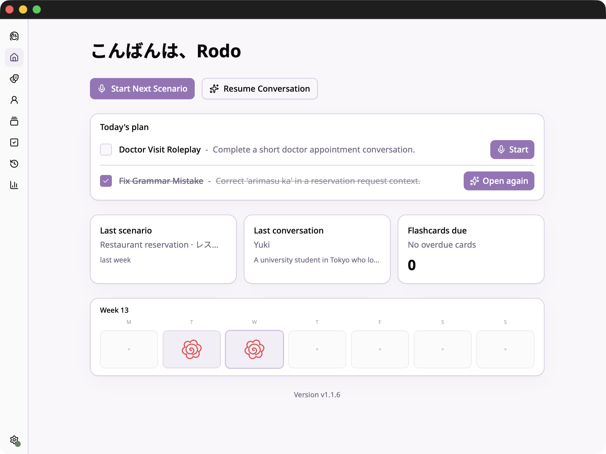

# Tama Desktop



Tama Desktop is a Japanese speaking and listening practice app for people who want more than flashcards, but still need structure.

It helps you practice real conversations, repeat useful lines out loud, review vocabulary, get feedback on your mistakes, and keep your study history in one place.

## Start Here

If you just want to use the app, this is the section to read.

### What Tama Is Good For

Tama is built for practical Japanese practice. You can use it to:

- practice everyday situations like restaurants, convenience stores, hotels, train stations, phone calls, and self-introductions
- speak out loud instead of only reading or typing
- get a simple daily plan when you are not sure what to study next
- save useful vocabulary from your sessions and review it later
- ask for explanations, drills, and quizzes without leaving the app
- keep long-term practice going with ongoing persona chats

### What You Can Do In The App

#### 1. Practice Real-World Scenarios

Choose a guided situation and talk through it by voice or text.

Examples:

- ordering at a restaurant
- asking for directions
- checking into a hotel
- talking about hobbies
- handling a phone call
- free practice on any topic

Each scenario gives you a setting, a role for the AI, and a few goals so you know what to aim for.

#### 2. Use Voice Or Text

You can practice by:

- speaking naturally with microphone input
- typing in Japanese if you want a quieter or slower session

If you use voice mode, Tama can transcribe what you say and read responses out loud when a voice engine is set up.

#### 3. Do Shadowing Practice

Shadow mode gives you a fixed dialogue to repeat line by line.

This is useful when you want to:

- copy natural pronunciation and rhythm
- practice set phrases before a trip or conversation
- build confidence before open-ended speaking

The app can show:

- hiragana readings for the lines
- optional translations
- your result for each attempt, so you can see whether you were close or need more work

#### 4. Keep Ongoing Persona Chats

You can create persistent chat partners instead of starting from zero every time.

For example, you can make:

- a friendly university student
- a coworker
- a travel buddy
- your own custom character

These chats keep their conversation history and can be resumed later, so they feel more like an ongoing relationship than a one-off roleplay.

#### 5. Get Feedback After A Session

After a scenario conversation, Tama can generate a feedback screen with:

- grammar fixes
- vocabulary worth learning
- fluency notes
- a simple performance rating
- a suggestion for what to work on next

You can save suggested vocabulary directly into your flashcards.

#### 6. Review Flashcards

Tama includes built-in spaced repetition review.

You can:

- review due vocabulary
- see whether cards are new, learning, or mature
- edit or delete cards
- export your deck to Anki

This is helpful if you want your speaking practice and your vocab review to stay connected.

#### 7. Take Saved Quizzes

Tama can save quizzes that were created through Sensei.

Quizzes support:

- multiple choice
- fill-in-the-blank
- dropdown-style answers
- saved scores for later review
- hiragana readings for Japanese text when needed

#### 8. Use Sensei As Your In-App Study Helper

Sensei is the built-in assistant you can open from anywhere in the app.

You can ask it to:

- explain a grammar point
- make a short drill for today
- create a quiz
- help you understand your current screen
- create a custom scenario
- create a new persona chat
- add a flashcard for a word you want to remember
- mark tasks in your daily plan as done

Sensei also uses your app context, so it can respond based on what you are currently studying instead of acting like a generic chatbot.

#### 9. Follow A Daily Plan

The home screen can generate a short study plan for the day using things like:

- flashcards that are due
- your recent performance
- recommended scenarios
- recent trouble spots

This is especially useful on days when you want to study but do not want to decide what to do first.

#### 10. Track Your Progress

Tama keeps your study history and progress in the app.

You can review:

- completed scenario sessions
- persona chat activity
- flashcard review sessions
- quiz attempts
- monthly activity
- new flashcards added over time

### A Typical Study Session

One simple way to use Tama:

1. Open the home screen and follow today’s plan.
2. Do one scenario or one shadowing session.
3. Read the feedback and save useful vocabulary.
4. Review your due flashcards.
5. Ask Sensei for a short drill or quiz on anything that still feels weak.

### Language And Voice Support

Current app capabilities include:

- app interface in English or Spanish
- Japanese conversation practice
- message translation buttons when you need help
- voice input with local Whisper or OpenAI Whisper API
- Japanese text-to-speech with VOICEVOX or Style-Bert-VITS2

### What You Need Before First Launch

For the main conversation features, configure one of these AI providers:

- Anthropic API key, or
- OpenRouter API key, or
- a local OpenAI-compatible server such as Ollama, LM Studio, or llama.cpp

Optional:

- OpenAI API key if you want to use OpenAI Whisper for speech transcription

The default local-model configuration expects Ollama at `http://127.0.0.1:11434/v1` with the `llama3.2` model. See [Use A Local AI Model](#use-a-local-ai-model) for setup instructions and other supported servers.

## Download And Install

Download the latest build from [Releases](https://github.com/rodolfo-terriquez/tama-desktop/releases).

Choose the file for your system:

- macOS (Apple Silicon): `*_aarch64.dmg`
- Windows (x64): `*_x64-setup.exe` or `*_x64_en-US.msi`
- Linux (x64): `*_amd64.AppImage`, `*_amd64.deb`, or `*.x86_64.rpm`

### macOS

1. Move `Tama Desktop.app` to `Applications`.
2. If macOS blocks the app because it is from an unidentified developer, run:

```bash
xattr -dr com.apple.quarantine "/Applications/Tama Desktop.app"
```

3. Start the app from Terminal once:

```bash
"/Applications/Tama Desktop.app/Contents/MacOS/tama-desktop"
```

4. If prompted, open `System Settings -> Privacy & Security` and click `Open Anyway`.
5. After that, you should be able to launch it normally.

### Windows

**Code signing policy:** Free code signing provided by
[SignPath.io](https://signpath.io/), certificate by
[SignPath Foundation](https://signpath.org/). The application is pending, so
current Windows installers are not yet Authenticode-signed. See the full
[Code Signing Policy](./CODE_SIGNING_POLICY.md).

1. Run the installer.
2. If SmartScreen appears, click `More info` and then `Run anyway`.
3. Open Tama Desktop from the Start Menu.

### Linux

Use the package format that matches your distro.

AppImage:

```bash
chmod +x Tama_*_amd64.AppImage
./Tama_*_amd64.AppImage
```

Debian or Ubuntu:

```bash
sudo apt install ./Tama_*_amd64.deb
```

Fedora or RHEL:

```bash
sudo dnf install ./Tama-*.x86_64.rpm
```

## First-Time Setup

When you open Tama for the first time:

1. Choose your interface language.
2. Choose Anthropic, OpenRouter, or a local model server for conversation AI.
3. Optionally add an OpenAI key for Whisper API transcription.
4. In Settings, choose your speech transcription option and voice engine.
5. If you want local speech recognition, download the Whisper model from Settings.

## Use A Local AI Model

Tama can connect to any server that implements the OpenAI-compatible `/v1/chat/completions` API. Every request includes the selected `model` and the conversation `messages`. This keeps conversation generation on your own computer when the server and model are local.

In Tama:

1. Open `Settings`.
2. Under `LLM Provider`, choose `Local`.
3. Enter the server endpoint. You can use either the base `/v1` URL or the full `/v1/chat/completions` URL.
4. Refresh the model list and select the model Tama should use. You can also enter an exact model identifier manually.
5. Leave the API key empty unless your server requires authentication.
6. Click `Save`, then start a conversation to confirm the connection.

### Ollama

Install [Ollama](https://ollama.com/download), then download the default model:

```bash
ollama pull llama3.2
```

Ollama normally starts its server automatically. If it is not running, start it with:

```bash
ollama serve
```

Use these Tama settings:

```text
Server endpoint: http://127.0.0.1:11434/v1
Model: llama3.2
API key: leave empty
```

Ollama documents its OpenAI-compatible endpoint and supported request fields in its [OpenAI compatibility guide](https://docs.ollama.com/api/openai-compatibility).

### LM Studio

1. Download and load a chat model in [LM Studio](https://lmstudio.ai/).
2. Open LM Studio's `Developer` tab and switch on `Start server`.
3. In Tama, refresh the model list and choose the loaded LM Studio model.

You can also start the server from LM Studio's CLI:

```bash
lms server start
```

Use these Tama settings:

```text
Server endpoint: http://127.0.0.1:1234/v1
Model: the loaded model identifier from LM Studio
API key: leave empty unless authentication is enabled
```

See LM Studio's [local server documentation](https://lmstudio.ai/docs/developer/core/server) for model loading, authentication, and local-network options.

### llama.cpp

Start `llama-server` with a chat-compatible GGUF model. The `--jinja` option enables template-based tool calling for models that support it:

```bash
llama-server -m /path/to/model.gguf --port 8080 --jinja
```

Use these Tama settings:

```text
Server endpoint: http://127.0.0.1:8080/v1
Model: the model identifier returned by http://127.0.0.1:8080/v1/models
API key: leave empty
```

More server options are available in the official [llama.cpp server documentation](https://github.com/ggml-org/llama.cpp/blob/master/tools/server/README.md).

### Troubleshooting

- `Network request failed`: make sure the local server is running and that the endpoint and port are correct.
- `404 Not Found`: use the server's OpenAI-compatible `/v1` endpoint, not its native API endpoint.
- `Model not found`: use the exact identifier returned by the server's `/v1/models` endpoint.
- Slow or incomplete responses: try a smaller model or increase the server's context size.
- Missing Sensei actions: choose a model with tool-calling support. Tama retries ordinary conversation without tools when a local model rejects them, but tool-driven app actions still require a capable model.
- Connecting to another computer: use that computer's LAN address, configure the server to listen on the network, and enable authentication. Do not expose an unauthenticated local-model server directly to the internet.

Selecting a local LLM does not automatically make speech features local. Choose Local Whisper for speech recognition and a local TTS engine if you want the full voice pipeline to remain on-device.

## Data, Privacy, And Backups

Tama stores your study data locally on your device.

That includes things like:

- sessions
- quizzes
- flashcards
- persona chats
- custom scenarios
- study plans
- non-secret settings

You can export a backup of your account data and restore it later.

Important:

- API keys are currently stored in local storage, not in the OS keychain
- account backups do not include secret API keys

Tama does not include analytics or a developer-operated backend. Configured AI
providers, optional downloads, and update checks make the network requests
described in the full [Privacy Policy](./PRIVACY.md).

## Current User-Facing Capabilities

As of July 2026, the app includes:

- guided scenario conversations with voice or text
- shadow speaking practice with line-by-line scoring
- custom scenarios you can create yourself or generate with AI help
- persistent persona chats with saved history
- Sensei chat with quiz creation and in-app actions
- saved quizzes with answer review and hiragana readings
- vocabulary feedback after scenario sessions
- spaced repetition flashcards with Anki export
- daily study plans on the home screen
- study history and monthly activity tracking
- account backup and restore
- local conversation AI through OpenAI-compatible model servers
- optional in-app update checks for production builds

## Build From Source

This section is only for development.

### Tech Stack

| Layer | Choice |
| --- | --- |
| Desktop shell | Tauri v2 |
| Frontend | React 19 + TypeScript + Vite 7 |
| UI | Tailwind CSS 4 + shadcn/ui |
| Local storage | SQLite + localStorage |
| LLM providers | Anthropic API or OpenRouter |
| Speech recognition | Local Whisper or OpenAI Whisper API |
| TTS | VOICEVOX or Style-Bert-VITS2 |

### Prerequisites

- Node.js 20+
- npm
- Rust toolchain

Optional local components:

- `7z` for in-app VOICEVOX download and extraction
- Python 3 if you want to run Style-Bert-VITS2 locally
- SBV2 model files in `sbv2-models/` if using SBV2

### Quick Start

```bash
npm install
npm run tauri dev
```

### Optional Local Voice Setup

#### VOICEVOX

VOICEVOX can be managed from the app settings.

Default endpoint:

```text
http://localhost:50021
```

#### Style-Bert-VITS2

Create a virtual environment and install dependencies:

```bash
python3 -m venv .venv
source .venv/bin/activate
pip install style-bert-vits2 fastapi uvicorn
```

Put model folders in `sbv2-models/`, then run:

```bash
python server/sbv2_api.py --port 5001 --models sbv2-models
```

### Available Scripts

```bash
npm run dev
npm run tauri dev
npm run build
npm run tauri build
npm run lint
npm run preview
```

### Project Structure

```text
src/                 React app
src-tauri/           Rust backend
server/sbv2_api.py   Optional SBV2 bridge
```

## Release Notes

For release and updater signing steps, see [RELEASE_CHECKLIST.md](./RELEASE_CHECKLIST.md).

Windows releases follow the project's [Code Signing Policy](./CODE_SIGNING_POLICY.md).

## License

This project is licensed under the GNU General Public License v3.0.

If you distribute the app or a modified version, you must also make the source available under the same license. See [LICENSE](./LICENSE).
